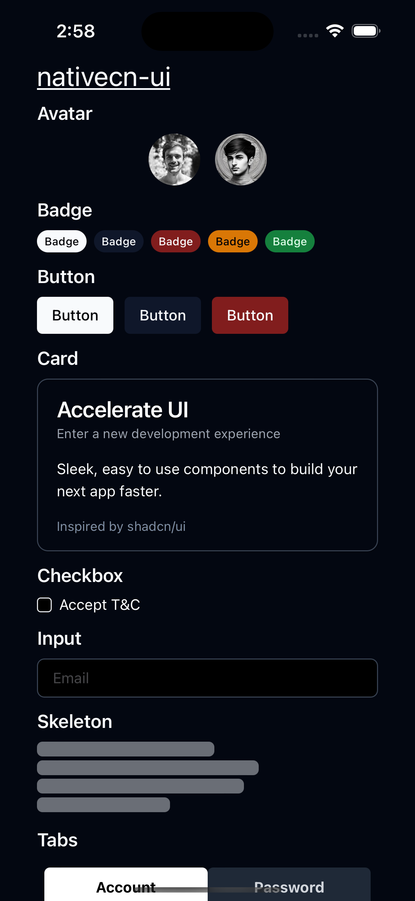
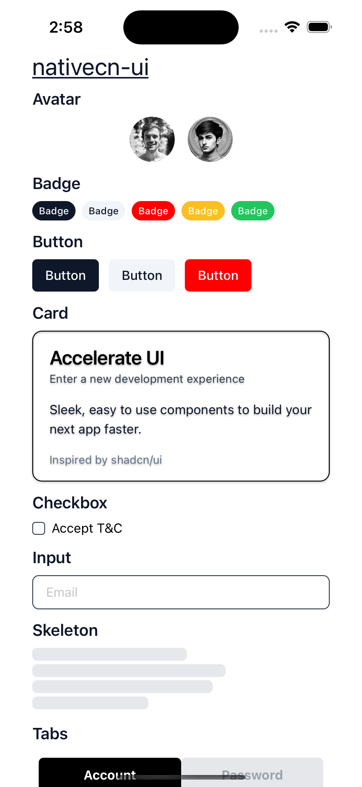

# nativecn-ui

Beautiful and customizable React Native components, inspired by [shadcn-ui](https://github.com/shadcn-ui/ui). Built-in dark mode, CSS variables, and NativeWind support.

|               Dark mode               |               Light mode               |
| :-----------------------------------: | :------------------------------------: |
|  |  |

## Usage

### I have an Expo project, how do I get started?

First, initialize nativecn from your project's root directory.

```bash
npx nativecn-ui init
```

Then, you can start adding components.

```bash
npx nativecn-ui add Avatar
```

> **Tip**: run `npx nativecn-ui add -a` to add all components.

### How do I run this locally?

```bash
# Clone the repo
git clone git@github.com:Mobilecn-UI/nativecn-ui.git
cd nativecn-ui

# Install deps
yarn

# Run it with Expo
yarn start
```

## Components

- [x] [Avatar](components/Avatar.tsx)
- [x] [Badge](components/Badge.tsx)
- [x] [Button](components/Button.tsx)
- [x] [Card](components/Card.tsx)
- [x] [Checkbox](components/Checkbox.tsx)
- [x] [Dialog](components/Dialog.tsx)
- [x] [Input](components/Input.tsx)
- [x] [Progress](components/Progress.tsx)
- [x] [Radio Group](components/RadioGroup.tsx)
- [x] [Skeleton](components/Skeleton.tsx)
- [x] [Switch](components/Switch.tsx)
- [x] [Tabs](components/Tabs.tsx)
- [x] [Toast](components/Toast.tsx)
- [x] [Dropdown](components/DropDown.tsx)
- [ ] Alert (WIP)
- [ ] Form (WIP)
- [ ] Select (WIP)

## Contributing

Check out the [contributing guide](https://github.com/Mobilecn-UI/nativecn-ui/blob/main/CONTRIBUTING.md)

## License

Distributed under the [MIT license](https://github.com/Mobilecn-UI/nativecn-ui/blob/main/LICENSE).


# MILABOT 

MILABOT APP IS AN REACT NATIVE APP


### How do I run this locally?

```bash
# Clone the repo
git clone https://github.com/MitchelCardona28/MilaBot.git
cd MILABOTAPP

# Install deps
yarn

# Run it with Expo
yarn start
```m run dev
```


## Run Server Side 

Go to the project directory

```bash
  cd server-bd
```

Install dependencies

```bash
  npm install
```

Start the server

```bash
  npm run dev
```

## Authors

- 
- [@lpfalcon](https://www.github.com/lpfalcon)
- [@MitchelCardona28](https://github.com/MitchelCardona28)


## Tech Stack

**Client:** React, TailwindCSS

**Server:** Node, Express


## Deploy

- 
- 

## License

[MIT](#)
